# Robot Arm 3D with Modern OpenGL

Classical robot arm implementation with OpenGL for computer graphic course project. 

# Requirements

- OpenGL >3.1 (notice GLui)
- GLui
- Freeglut

# Compile & Run

    make && ./main
    
# Screenshots
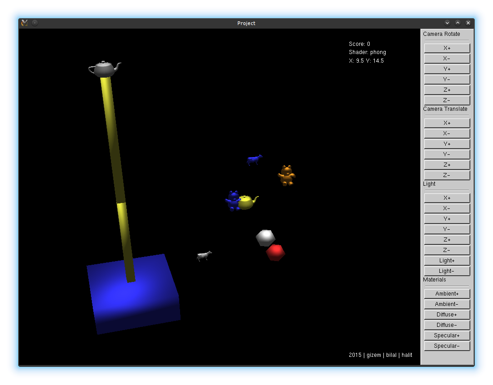
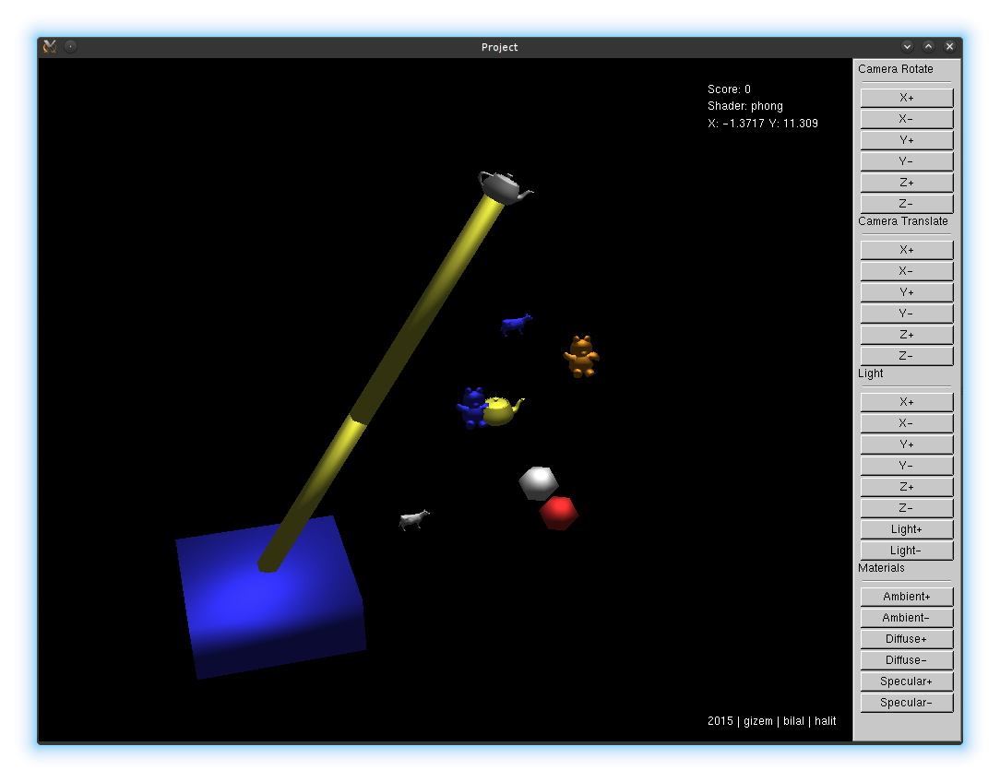
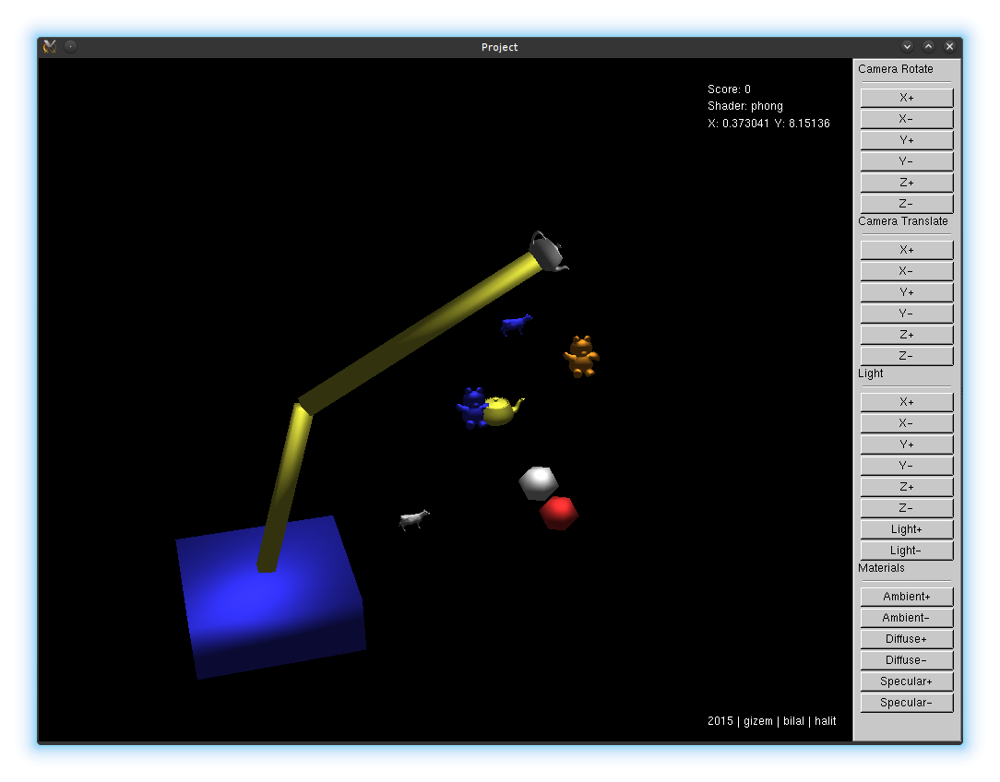
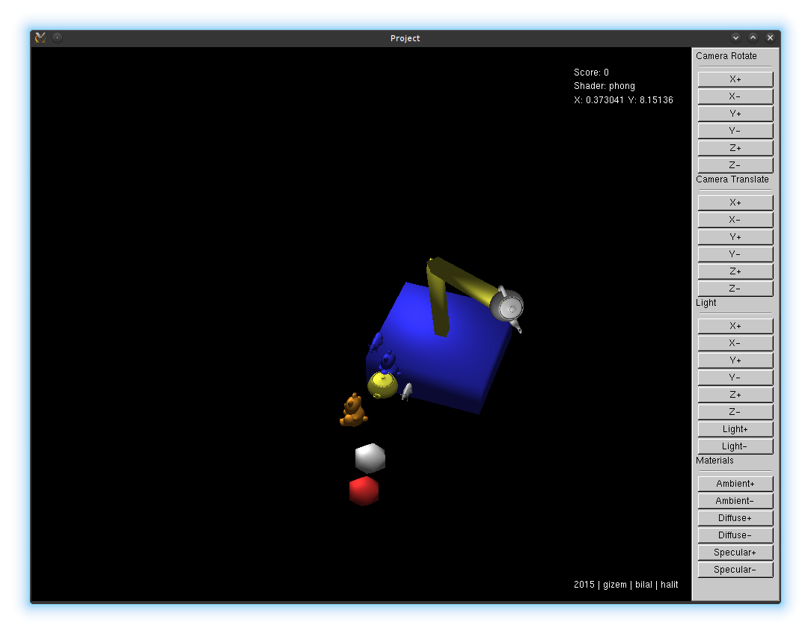
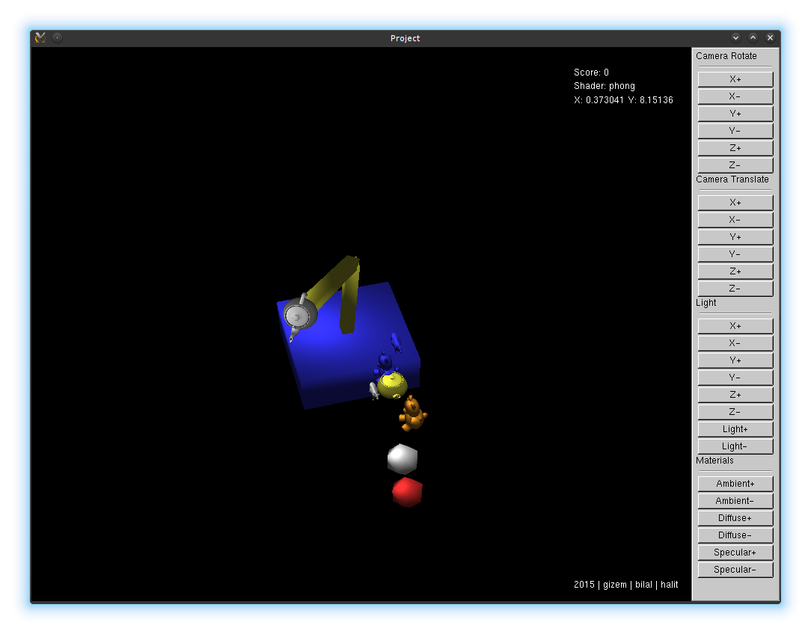
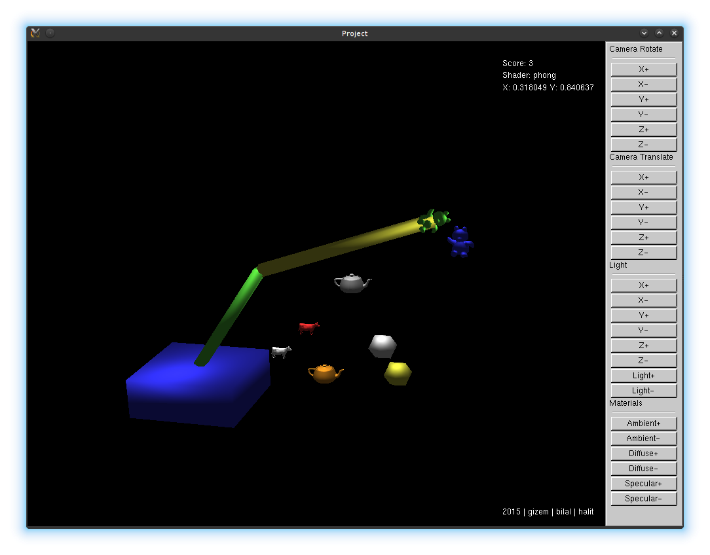
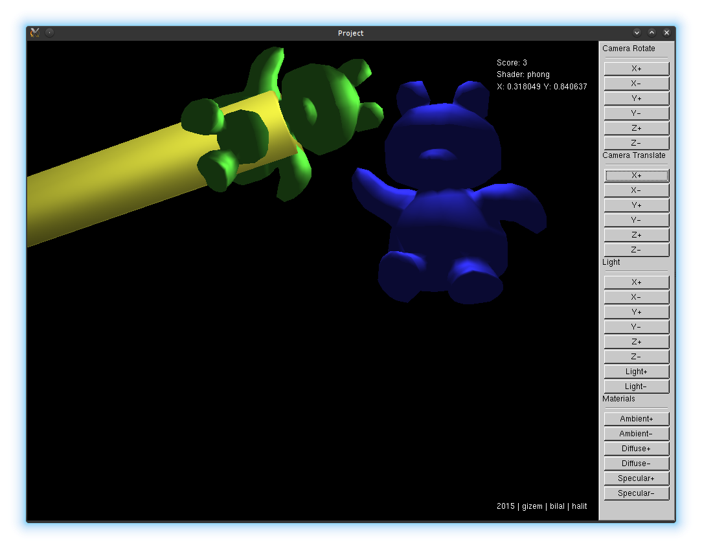
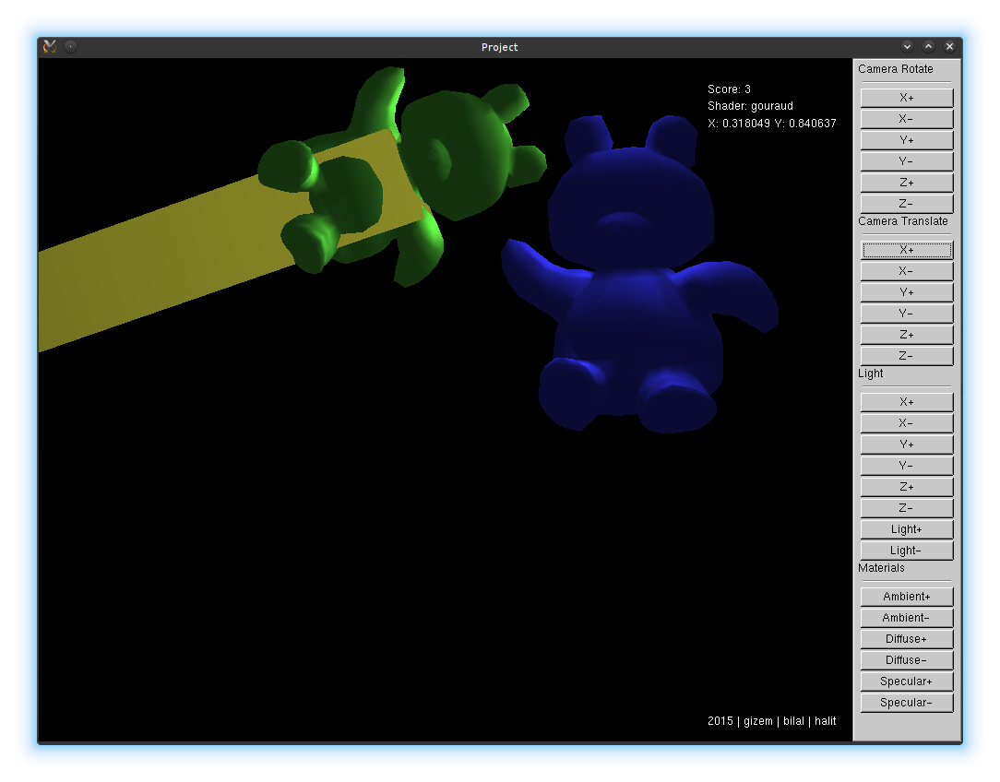
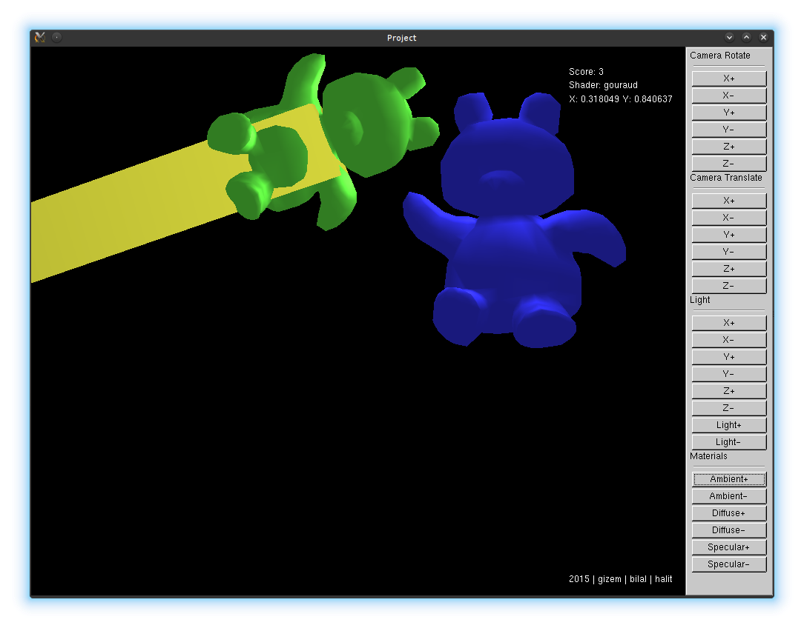
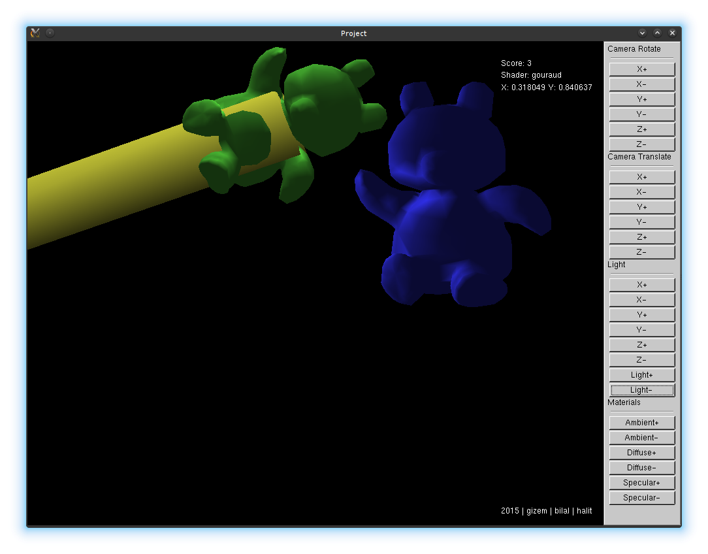
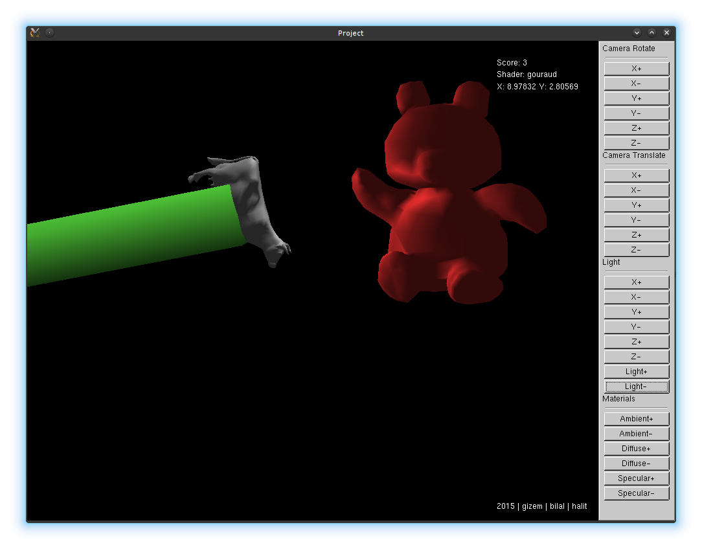
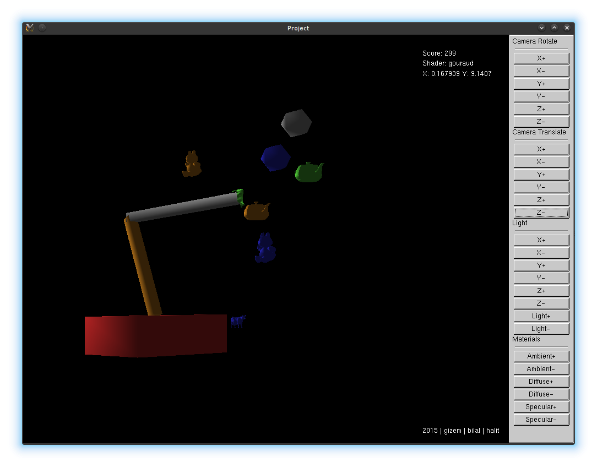

# Video

http://www.youtube.com/watch?v=wmSSw61BaJ8

# Authors

- Halit Alptekin
- Bilal Akıncı
- Gizem İskenderoğlu
